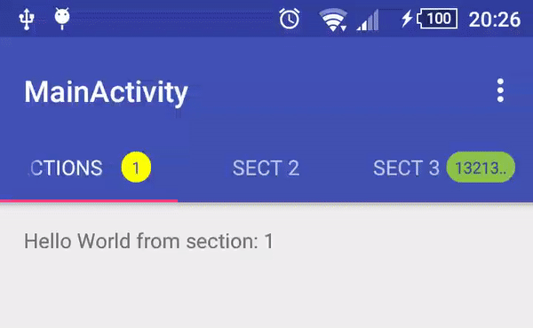

# BadgedTabLayout
[](https://jitpack.io/#rahimlis/badgedtablayout)
[](https://android-arsenal.com/details/1/6087)
[](https://github.com/rahimlis/badgedtablayout/issues)
[](https://opensource.org/licenses/MIT)

Did you see those small badges indicating new messages count in WhatsApp near your chats? 
You can achieve the same result using this library. It is created to add small circled badges in tab layout.
### Screen

# Installation
```groovy
allprojects {
 repositories {
   ...
   maven { url 'https://jitpack.io' }
  }
}
```

```groovy
dependencies {
  compile 'com.github.rahimlis:badgedtablayout:v1.0'
}
```

# Usage
Add BadgedTabLayout as if you added TabLayout itself
```xml 
<android.support.design.widget.AppBarLayout ...>
  
  <android.support.v7.widget.Toolbar ... />
    
  <com.rahimlis.badgedtablayout.BadgedTabLayout
       android:id="@+id/tabs"
       android:layout_width="match_parent"
       android:layout_height="wrap_content"
       app:badgeBackgroundColor="@color/badge_background_color"
       />

  </android.support.design.widget.AppBarLayout>
```
then in java do:

```java
BadgedTabLayout tabLayout = (BadgedTabLayout) findViewById(R.id.tabs);
tabLayout.setupWithViewPager(mViewPager);
```
to set text of the badge use:
```java
  //first parameter is the tab index, at which badge should appear
  tabLayout.setBadgeText(1,"1");
  //if you want to hide a badge pass null as a second parameter
  tablayout.setBadgeText(0,null);
```
**Note:** by default badges are hidden. You need to set some text to show it up.

# Customization
you can customize tab text colors as if you would do it for tabLayout
```xml
app:tabTextColor="@color/your_unselected_text_color"
app:tabSelectedTextColor="@color/your_selected_text_color"
```
additionally you can change badge background color, as well as badge text color and text size
```xml
app:tabTextColor="@color/your_unselected_text_color"
app:tabSelectedTextColor="@color/your_selected_text_color"
app:badgeTextColor="@color/your_selected_color"
app:badgeSelectedTextColor="@color/your_selected_color"
app:badgeBackgroundColor="@color/your_selected_color"
app:badgeSelectedBackgroundColor="@color/your_selected_color"
app:badgeTextSize="11sp"
```
another way to do this is to create color state list and pass it to corresponding field:
```xml
<!-- file badge_background_color.xml / badge_text_color.xml at color directory -->
<selector xmlns:android="http://schemas.android.com/apk/res/android">
    <item android:color="#ff0" android:state_selected="true" />
    <item android:color="#f0f" android:state_selected="false" />
</selector>
```
then:
```xml
app:badgeBackgroundColor="@color/badge_background_color"
app:badgeTextColor="@color/badge_text_color"
```
you also can change every property programmatically, look at class documentation for more information.
# Contribution
Feel free to make pull requests and open issues if you meet any.   
Please add your app name if you use this library in the issues. I will add your app into the list. 
